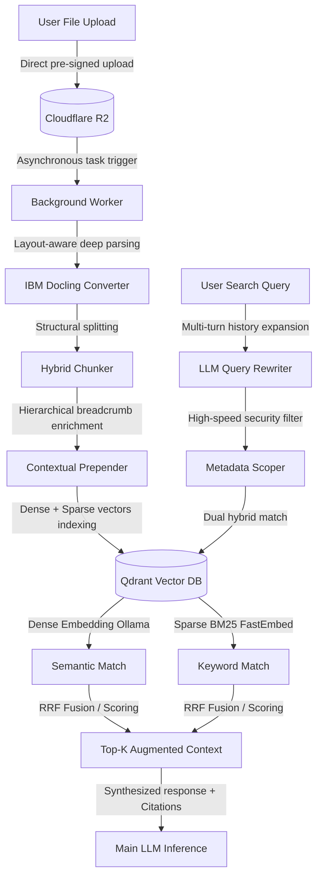

<!-- Improved top-level README designed for clarity and professionalism. -->

<p align="center">
	
	<h1 align="center">LearnSync</h1>
</p>

[](LICENSE)
[](frontend)
[](backend)
[](#)

LearnSync is a full-stack AI-powered learning and productivity platform combining a modern Next.js frontend with a FastAPI backend. It provides AI chat, course workspaces, quizzes, calendar sync, routine extraction, and file-based knowledge indexing.

## Quick links

- Source: `frontend/` and `backend/`
- Demo screenshots: `frontend/outputs/`
- Architecture diagram: `frontend/outputs/architecture_diagram1.svg`
- Docs & contributing: `CONTRIBUTING.md`

## Key features

- Streaming AI chat with conversation contexts and folders
- File uploads with background ingestion, chunking, and vector indexing
- Course workspace with mind maps and quiz generation
- Google Calendar integration and routine extraction from images
- Rich text editor (Tiptap) and translation utilities
- JWT cookie auth + Google OAuth, admin and user settings

## 🚀 Recruiter Spotlight: Production-Grade RAG Engine

LearnSync features a modern, industry-grade **Retrieval-Augmented Generation (RAG)** engine built to solve real-world retrieval issues like semantic dilution, context loss, data fragmentation, and exact-keyword search failures. 

Rather than using basic, naive langchain wrappers, LearnSync implements a high-performance, layout-aware pipeline:



### The 6 Technical Pillars of the LearnSync RAG Engine

Browse the direct implementation files to review the production-level code patterns:

1. **Layout-Aware Deep Parsing (IBM Docling)** 
   * **Source:** [ingestion.py (L76-104)](backend/src/rag/ingestion.py#L76-L104)
   * **Mechanism:** Naive PDF parsers discard layout, column flows, and table structures. LearnSync utilizes **IBM's Docling** (`DocumentConverter`), employing deep-learning layout models to reconstruct the structural layout of documents before chunking.
2. **Structure-Preserving Hybrid Chunking**
   * **Source:** [ingestion.py (L91-101)](backend/src/rag/ingestion.py#L91-L101)
   * **Mechanism:** Leverages Docling's `HybridChunker` to respect native boundaries (headers, lists, tables). This stops data fragmentation (like cutting a table row in half) and intelligently groups small chunks under a token-informed budget (up to 500 tokens).
3. **Contextual Breadcrumb Enrichment**
   * **Source:** [ingestion.py (L12-73)](backend/src/rag/ingestion.py#L12-L73)
   * **Mechanism:** Solves the *"lost in chunking"* problem. During ingestion, it recursively extracts a chunk's hierarchical position (e.g., `Syllabus > Chapter 3 > Grading Criteria`) and prepends it to the chunk content prior to embedding. This maintains context even when the retrieved text is highly specific.
4. **Multi-Turn Query Rewriting & Expansion**
   * **Source:** [rag_node.py (L12-38)](backend/src/agents/nodes/rag_node.py#L12-L38)
   * **Mechanism:** Converts conversational multi-turn queries (e.g., *"how is it graded?"*) into a retrieval-focused search query by expanding the query with context and history (e.g., *"CS101 grading breakdown percentage syllabus assignments exams"*).
5. **Secure, Scoped Metadata Filtering**
   * **Source:** [rag_node.py (L47-74)](backend/src/agents/nodes/rag_node.py#L47-L74)
   * **Mechanism:** Applies high-speed **Qdrant native field filtering** (`Filter`, `MatchAny`, `MatchValue`) at search time. This ensures total data isolation, restricting the RAG scope to the user's specific `user_id` and selected `file_ids`, `folder_id`, or current conversation.
6. **Dual-Engine Hybrid Search (Dense + Sparse)**
   * **Source:** [store.py (L53-66)](backend/src/rag/store.py#L53-L66) & [retrieval.py (L7-23)](backend/src/rag/retrieval.py#L7-L23)
   * **Mechanism:** Fuses semantic similarity with keyword match. Combines **Dense Vector Search** (`OllamaEmbeddings`) for synonyms and conceptual matching, with **Sparse Vector Search** (`FastEmbedSparse` with `Qdrant/bm25`) for matching exact IDs, technical jargon, and codes.

---

### 🔎 Concrete RAG Execution Trace (End-to-End Inputs/Outputs)

Here is a dry-run trace demonstrating how a complex document layout is ingested, retrieved, and synthesized into a precise response:

#### 1. Ingestion Phase (Document Parsing & Enrichment)
* **Uploaded File:** `LLM_Agents_Overview.pdf`
* **Raw Document Layout:**
  ```text
  1. Introduction to Agentic Workflows
     ...
     1.3 Evaluation & Performance
         Table 2: Planner latency comparison
         | Planner Model  | Latency (s) | Success Rate |
         | ReAct          | 1.2         | 78%          |
         | Plan-and-Solve | 3.8         | 92%          |
  ```
* **Resulting Ingested Chunk (`_convert_chunk_to_document`):**
  ```python
  # Metadata extracted
  metadata = {
      "source": "LLM_Agents_Overview.pdf",
      "page": 4,
      "section": "1. Introduction to Agentic Workflows > 1.3 Evaluation & Performance > Table 2",
      "type": "table",
      "user_id": "user_dev_99",
      "document_id": "doc_agent_01"
  }
  
  # Page content with prepended breadcrumbs (ensuring semantic contextual retrieval)
  page_content = """
  Context: 1. Introduction to Agentic Workflows > 1.3 Evaluation & Performance > Table 2
  Content: Table 2: Planner latency comparison. Planner Model | Latency (s) | Success Rate. ReAct | 1.2 | 78%. Plan-and-Solve | 3.8 | 92%.
  """
  ```

#### 2. Query Phase (Rewriting & Scoping)
* **Conversation History:**
  * **User:** *"I'm reading the agent overview PDF."*
  * **Assistant:** *"Great! How can I help you with that?"*
  * **User:** *"how fast is the plan and solve one compared to react?"*
* **LLM Query Expansion output (`rewrite_query`):**
  ```text
  "Plan-and-Solve versus ReAct planner model latency speed comparison success rate agentic workflows table"
  ```
* **Qdrant Search Conditions:**
  ```python
  # Hard constraint: limits search exclusively to the selected document
  filter_conditions = [
      FieldCondition(key="metadata.user_id", match=MatchValue(value="user_dev_99")),
      FieldCondition(key="metadata.document_id", match=MatchAny(any=["doc_agent_01"]))
  ]
  ```

#### 3. Retrieval & Synthesis Phase (Fusing & Answering)
* **Hybrid Search (Dense + Sparse Qdrant Fusion):**
  * *Dense Vector* matches the intent *"how fast"* / *"compared to"*.
  * *Sparse Vector* anchors the exact keys *"Plan-and-Solve"* and *"ReAct"*.
  * **Top-1 Match retrieved:** The exact Table 2 chunk above (RRF score: `0.957`).
* **Final LLM Response (`rag_node` output):**
  ```text
  Based on Table 2 in `LLM_Agents_Overview.pdf` (Page 4, Section: `1. Introduction to Agentic Workflows > 1.3 Evaluation & Performance`):

  - **Plan-and-Solve** has a latency of **3.8 seconds** with a **92% success rate**.
  - **ReAct** has a latency of **1.2 seconds** with a **78% success rate**.

  **Comparison:** Plan-and-Solve takes approximately **2.6 seconds longer** (about 3.1x the latency of ReAct), but delivers a **14% absolute increase** in success rate.
  ```

---

## 🏗️ Architecture & Core Components

LearnSync is organized as a clear, decoupled full-stack system. The React frontend interacts with the FastAPI backend via cookie-authenticated REST APIs and Server-Sent Events (SSE) for AI streaming.


- **Frontend:** Next.js 15 App Router (`frontend/`) — React, TypeScript, TailwindCSS, Zustand state stores.
- **Backend:** FastAPI (`backend/`) — SQLAlchemy (asynchronous ORM), LangGraph (multi-agent orchestration), LangChain core integration.
- **Storage Layer:** PostgreSQL (relational user/app data), Qdrant (high-speed hybrid vector store), Cloudflare R2 (object storage for pre-signed file uploads).

---

## 📸 Interactive Visual Interface

Here are the primary workspaces of LearnSync. Review the full design specs in `frontend/outputs/`:

### Main Dashboard & Workspace Hub


### RAG-Powered AI Chat (Active Ingestion & Source Citations)


<details>
<summary>📂 Click to expand the Complete Application Gallery (11+ additional screens)</summary>
<br>

A closer look at the premium, responsive UI elements implemented throughout LearnSync:

| Section | Interface Description | Screenshot |
| :--- | :--- | :--- |
| **Course Workspace** | Dynamic study folder containing modules, AI summaries, and files. |  |
| **Interactive Mind Maps** | Auto-generated modular mind maps representing document structures. |  |
| **AI Quiz Generation** | Configure custom difficulty, count, and topic targets. |  |
| **Interactive Quiz Interface** | Live testing playground with timing constraints. |  |
| **Immediate Quiz Feedback** | Detailed corrections showing explanation logs and correct answers. |  |
| **Google Calendar Hub** | Standard calendar sync displaying extracted routines. |  |
| **Class Schedule Extract** | Weekly schedule view loaded asynchronously from user inputs. |  |
| **Rich Document Editor** | Tiptap-powered editor containing translate, format, and expand tools. |  |
| **Peer Chat Messenger** | Real-time direct message client with peer context syncing. |  |
| **Administrative Panel** | User overview list, token trackers, and diagnostic panels. |  |
| **Profile Settings** | Manage credentials and adjust visual display parameters. |  |
| **System Settings** | Toggle custom themes, font faces, and localized clock limits. |  |

</details>

---

## 🛠️ Tech Stack & Ecosystem

- **Frontend:** Next.js (App Router), React, TypeScript, TailwindCSS, Zustand, TanStack Query.
- **Backend:** FastAPI, Python, SQLAlchemy (Async), LangGraph, LangChain, PyDantic.
- **AI Core:** Google Gemini 2.5 Flash, Groq, Ollama Embeddings, IBM Docling.
- **Infrastructure:** Microsoft Azure, Cloudflare R2, PostgreSQL, Qdrant Hybrid Cloud.

## Local setup (developer)

1. Backend

```bash
cd backend
python -m venv .venv
source .venv/bin/activate
pip install -r requirements.txt
uvicorn src.main:app --reload --host 0.0.0.0 --port 8000
```

2. Frontend

```bash
cd frontend
pnpm install
pnpm dev
```

3. Environment

Copy the example environment file and fill values:

```bash
cp backend/.env.example backend/.env
```

Minimum variables (see `backend/.env.example`):

- `DATABASE_URL`
- `JWT_SECRET`
- `R2_ACCESS_KEY` / `R2_SECRET_KEY` / `R2_BUCKET`
- `GOOGLE_CLIENT_ID` / `GOOGLE_CLIENT_SECRET`
- `QDRANT_URL` / `QDRANT_API_KEY`


## API overview

Primary endpoints (same as before):

- `POST /auth/signup` - create an email/password account.
- `POST /auth/login` - sign in with email/password.
- `GET /auth/login/google` - start Google OAuth.
- `GET /auth/callback` - finish Google OAuth.
- `GET /me` - get the current user.
- `PATCH /me/settings` - update theme, timezone, or font.
- `POST /conversation` - start a new streaming chat.
- `POST /conversation/{conversation_id}` - continue a conversation.
- `GET /conversation` - list folders and conversations.
- `POST /uploads/presign` - create R2 upload URLs.
- `POST /uploads/confirm` - confirm uploads and queue processing.
- `GET /calendar` - list Google Calendar events.
- `POST /calendar` - create a calendar event.
- `GET /routines` - load the current routine.
- `POST /routines/generate-from-image` - extract a routine from an image.
- `POST /routines/confirm` - save an approved routine.
- `POST /mcq/generate` - generate quizzes from study content.
- `POST /messaging/send` - send a direct message.
- `GET /editor/translate` - translate Banglish or Bangla text to English.

## Contributing

See [CONTRIBUTING.md](CONTRIBUTING.md) for guidelines on reporting issues and submitting pull requests.

## License

This repository is licensed under the MIT License — see [LICENSE](LICENSE) for details.