<!-- Improved top-level README designed for clarity and professionalism. -->

<p align="center">
	
	<h1 align="center">LearnSync</h1>
</p>

[](LICENSE)
[](frontend)
[](backend)
[](#)

LearnSync is a full-stack AI-powered learning and productivity platform combining a modern Next.js frontend with a FastAPI backend. It provides AI chat, course workspaces, quizzes, calendar sync, routine extraction, and file-based knowledge indexing.

## Quick links

- Source: `frontend/` and `backend/`
- Demo screenshots: `frontend/outputs/`
- Architecture diagram: `frontend/outputs/architecture_diagram1.svg`
- Docs & contributing: `CONTRIBUTING.md`

## Key features

- Streaming AI chat with conversation contexts and folders
- File uploads with background ingestion, chunking, and vector indexing
- Course workspace with mind maps and quiz generation
- Google Calendar integration and routine extraction from images
- Rich text editor (Tiptap) and translation utilities
- JWT cookie auth + Google OAuth, admin and user settings

## Screenshots

Gallery (see `frontend/outputs` for originals):

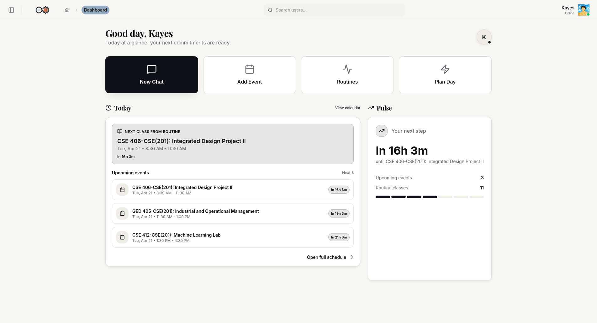
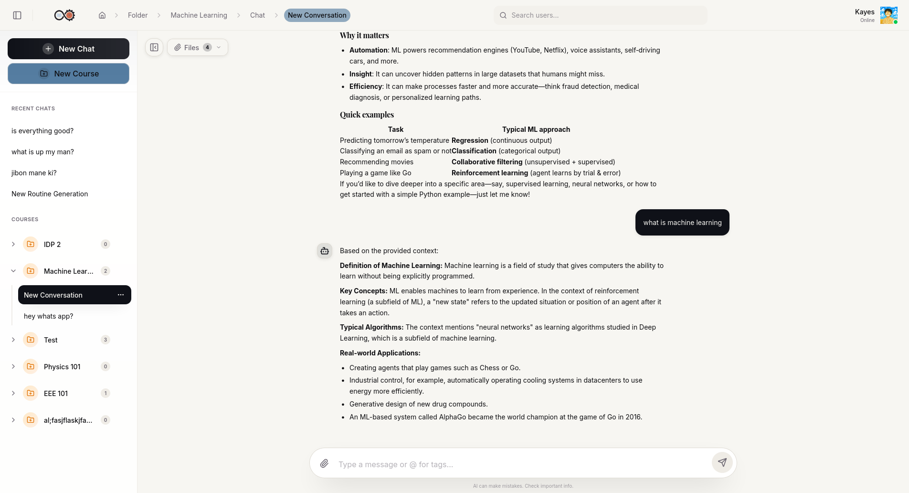
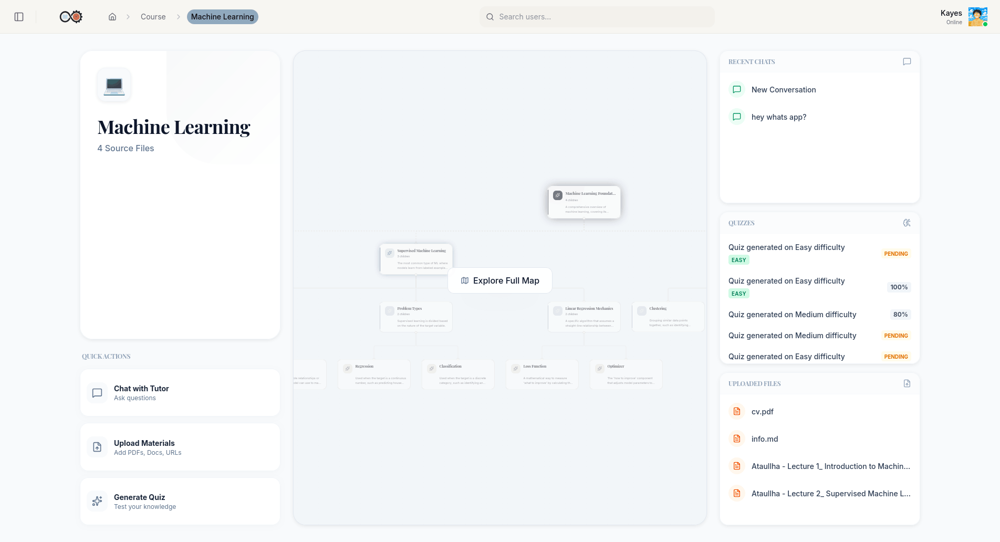
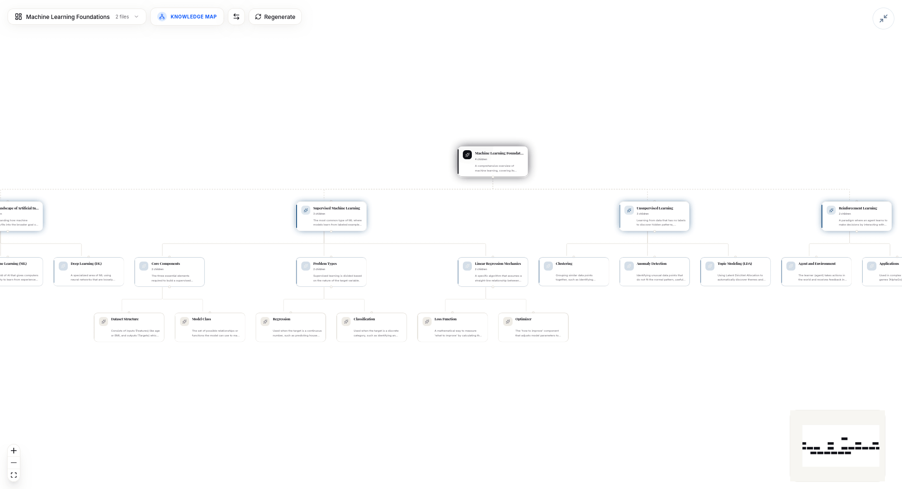

## More UI screenshots

A selection of additional UI screens from the app (see `frontend/outputs/` for full-resolution images):

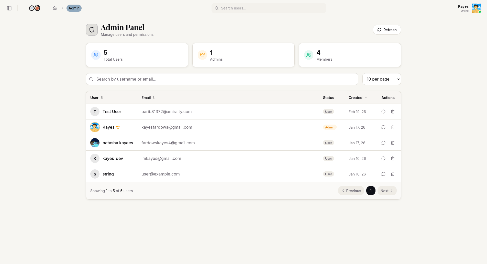
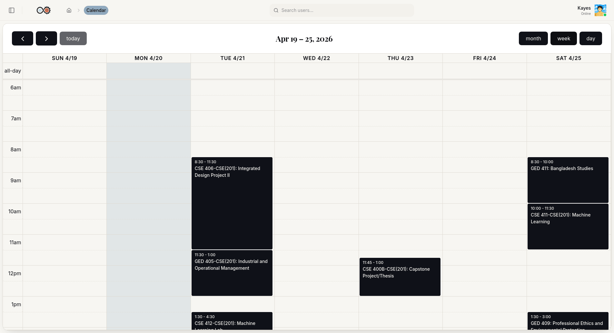
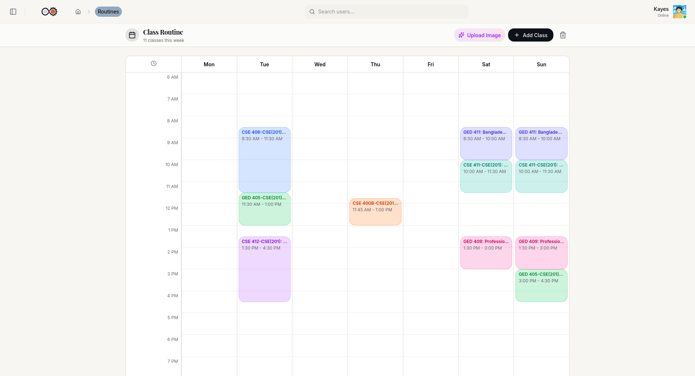
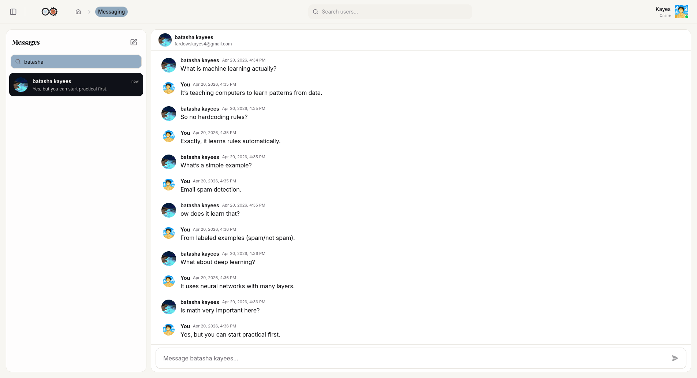
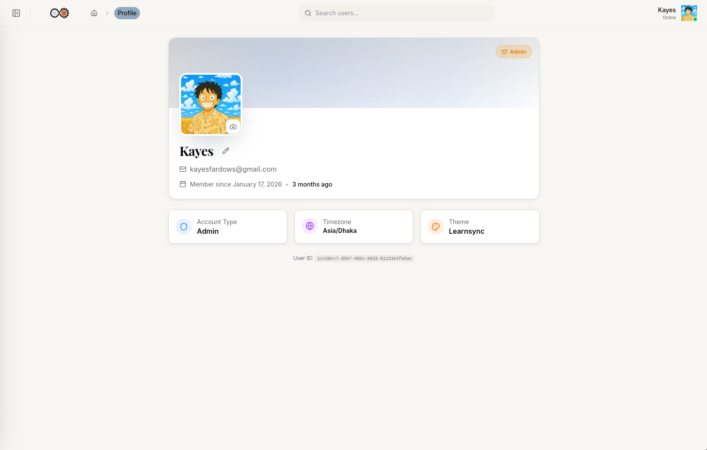
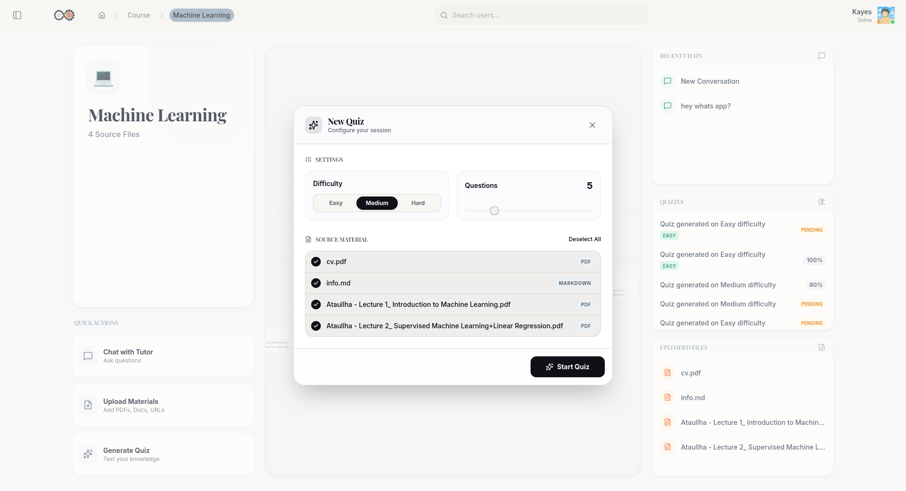
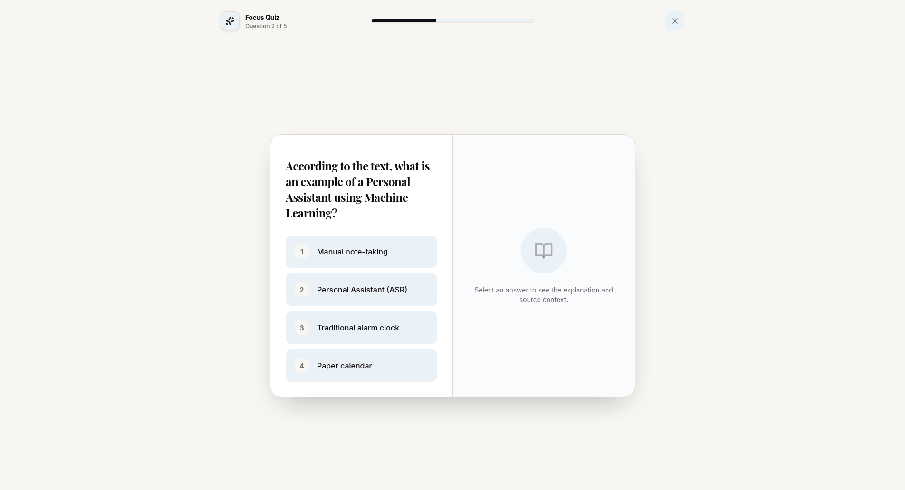
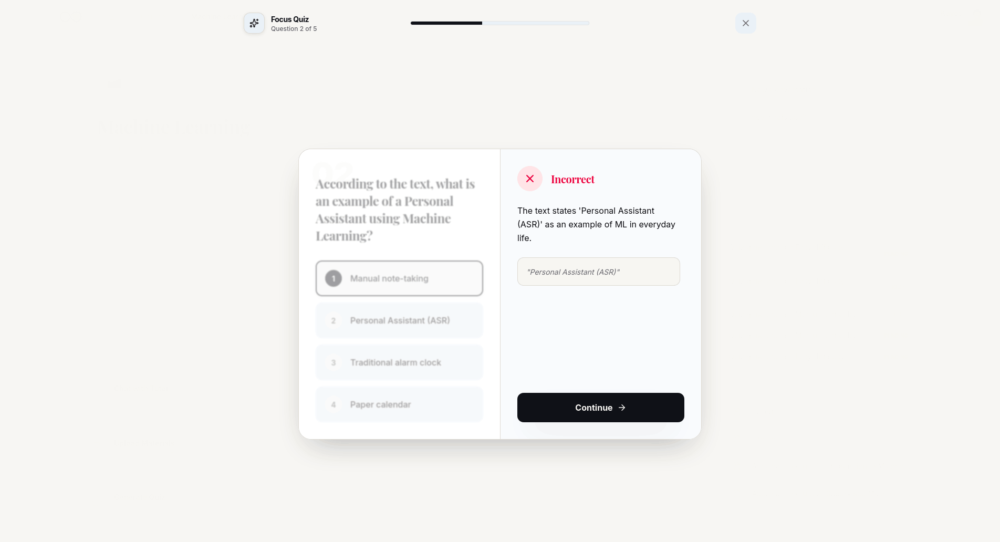
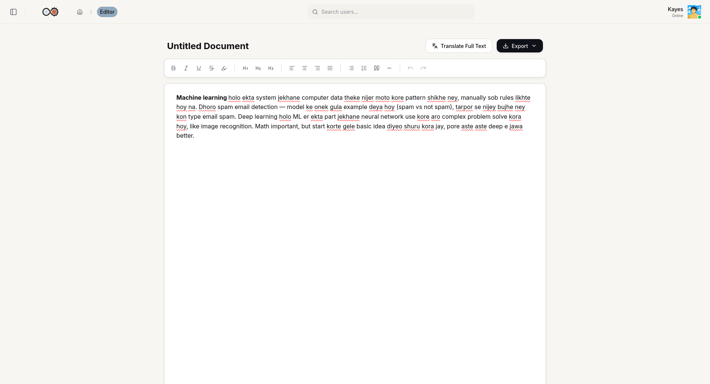
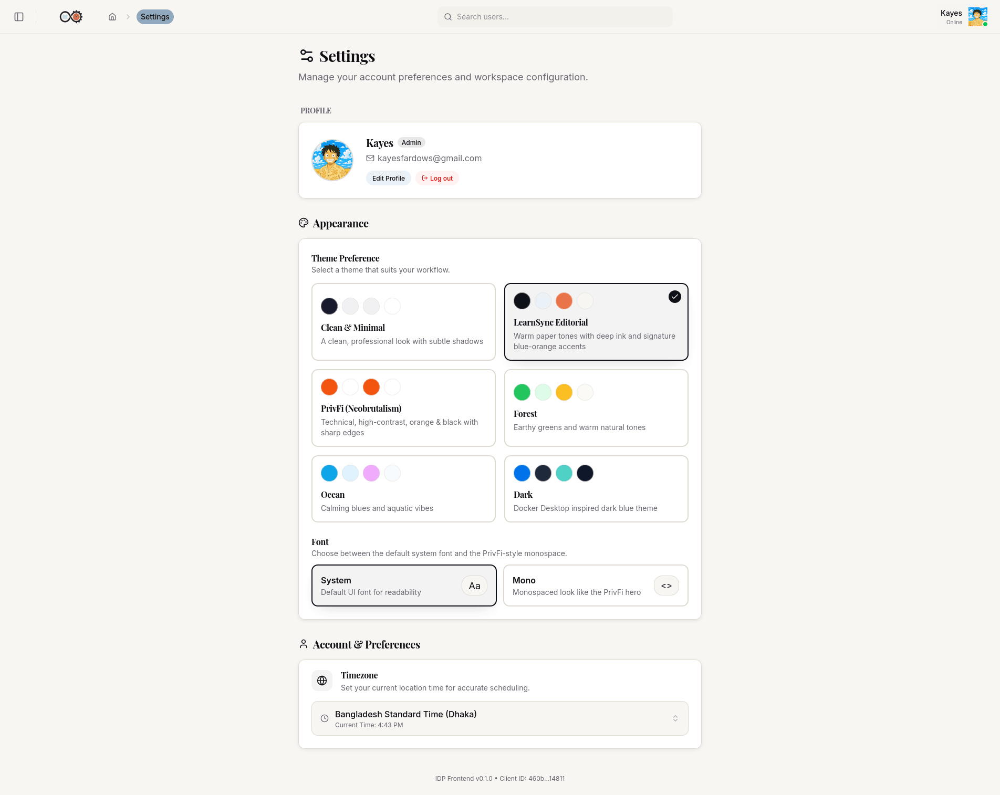

## Architecture

The system is organized as a clear frontend/backend split. The frontend communicates with the backend over REST (cookie-based auth) and SSE for streaming chat. Background tasks handle ingestion and RAG pipeline steps. Storage includes PostgreSQL, Qdrant, and Cloudflare R2.


### Components

- Frontend: Next.js App Router (`frontend/`) — React, TypeScript, Tailwind, Zustand
- Backend: FastAPI (`backend/`) — SQLAlchemy (async), LangGraph, LLM integrations
- Storage: PostgreSQL (relational), Qdrant (vector DB), Cloudflare R2 (file storage)

## Tech stack

- Frontend: Next.js, React, TypeScript, Tailwind, Zustand, TanStack Query
- Backend: FastAPI, Python, SQLAlchemy (async), LangGraph, LangChain
- AI: Google Gemini, Groq, Ollama
- Hosting: Microsoft Azure

## Local setup (developer)

1. Backend

```bash
cd backend
python -m venv .venv
source .venv/bin/activate
pip install -r requirements.txt
uvicorn src.main:app --reload --host 0.0.0.0 --port 8000
```

2. Frontend

```bash
cd frontend
pnpm install
pnpm dev
```

3. Environment

Copy the example environment file and fill values:

```bash
cp backend/.env.example backend/.env
```

Minimum variables (see `backend/.env.example`):

- `DATABASE_URL`
- `JWT_SECRET`
- `R2_ACCESS_KEY` / `R2_SECRET_KEY` / `R2_BUCKET`
- `GOOGLE_CLIENT_ID` / `GOOGLE_CLIENT_SECRET`
- `QDRANT_URL` / `QDRANT_API_KEY`


## API overview

Primary endpoints (same as before):

- `POST /auth/signup` - create an email/password account.
- `POST /auth/login` - sign in with email/password.
- `GET /auth/login/google` - start Google OAuth.
- `GET /auth/callback` - finish Google OAuth.
- `GET /me` - get the current user.
- `PATCH /me/settings` - update theme, timezone, or font.
- `POST /conversation` - start a new streaming chat.
- `POST /conversation/{conversation_id}` - continue a conversation.
- `GET /conversation` - list folders and conversations.
- `POST /uploads/presign` - create R2 upload URLs.
- `POST /uploads/confirm` - confirm uploads and queue processing.
- `GET /calendar` - list Google Calendar events.
- `POST /calendar` - create a calendar event.
- `GET /routines` - load the current routine.
- `POST /routines/generate-from-image` - extract a routine from an image.
- `POST /routines/confirm` - save an approved routine.
- `POST /mcq/generate` - generate quizzes from study content.
- `POST /messaging/send` - send a direct message.
- `GET /editor/translate` - translate Banglish or Bangla text to English.

## Contributing

See [CONTRIBUTING.md](CONTRIBUTING.md) for guidelines on reporting issues and submitting pull requests.

## License

This repository is licensed under the MIT License — see [LICENSE](LICENSE) for details.